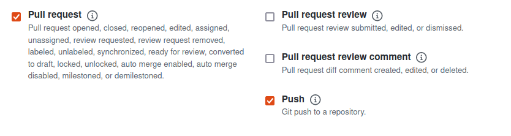
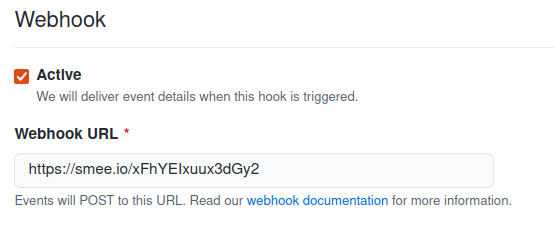

# Welcome to github-PR-automation 👋


[](https://travis-ci.com/snimmagadda1/github-PR-automation)
[](https://goreportcard.com/report/github.com/snimmagadda1/github-PR-automation)

> A minimal, performant bot responding to github events to make life easier

Built with Github Apps & Golang, the bot monitors an entire organization or list of repositories to keep branches in-sync automatically. This is especially useful when handling multiple repositories with individual release branches (i.e microservices). When changes are pushed to release branches (i.e bug/hotfixes) you want those changes merged down into master:


This bot an alternative to Github Actions. Whereas actions need to be configured at the repository level, this bot can be configured at the organization level. Note: this comes with some hosting tradeoffs.

## Usage
A Github app must be registered before running. In the Github UI, set the webhook secret to `development`. Set the webhook URL After deploying/running with one of options below. Under developer settings, ensure the app has sufficient R/W repository permissions to create PRs and is subscribed to the following events:



Some environment variables must be set to deploy/run locally:

| Key      | Type   | Description          | Example        |
| -------- | ------ | -------------------- | -------------- |
| `APP_ID` | String | Github app ID             | 1234      |
| `CERT_PATH` | String | Path to Github app private key  (pem)      | /app/keys/bot.pem         |
| `GITHUB_ENTERPRISE_URL`  | String | Optional enterprise URL | https://github.XXX.com/api/v3        |
| `GITHUB_ENTERPRISE_UPLOAD_URL`   | String | Optional enterprise upload URL | https://github.XXX.com/api/v3/upload |
| `MASTER_BRANCH` | String | master branch name to merge down to       | main         |
| `RELEASE_BRANCH` | String | release branch name to monitor       | release-1.0.1         |
| `REPOS` | String | Comma separated list of repos to watch       | api1-repo, api2-repo, ui1-repo, ui2-rpo         |


[A docker image is readily available](https://hub.docker.com/repository/docker/snimmagadda/github-pr-bot). **To deploy via k8s**, simply tailor the environment variables in [k8s.yaml](./deploy/k8s.yaml) to your use case:
```
kubectl create -f deploy/k8s.yaml
```

[Smee.io](https://smee.io/) is recommended for forwarding events from Github to your local machine. Simply start a channel and change the webhook URL to your channel's URL. 



To run the bot from source, create a `.env` file in the project root and set the required env vars. The project can then be run:

```go
go run cmd/main.go
```

The bot should start responding to events:

```log
2021/06/06 12:46:39 Initialized environment with appId: 119220, owner: XXXX, certPath: /home/XXX/bot.pem, enterpriseUrl: , enterpriseUploadUrl: , releaseBranch: release1, repos: [test]
2021/06/06 12:46:39 Ready to handle github events
2021/06/06 12:47:28 received push event
2021/06/06 12:47:28 received unregistered GitHub event: event not defined to be parsed
2021/06/06 12:47:29 created pull request: https://api.github.com/repos/XXX/test/pulls/5
```


## Extending
The bot is extensible! The "heavy lifting" occurs in the `Handle` function. Right now it only responds to `PushEvent`s. Processing different types of events from the Github API is as simple as adding a handler to the switch statement:

```go
func Handle(response http.ResponseWriter, request *http.Request) {
	hook, err := ghwebhooks.New(ghwebhooks.Options.Secret(webhookSecret))
	
    .
    .
    .

	switch payload := payload.(type) {
	case ghwebhooks.PushPayload:
		log.Println("received push event")
		// handle async b/c github wants speedy replies
		go processEvent(&payload)
	default:
		log.Println("missing handler")
		log.Printf("receieved release payload of type %v", payload)
	}

	response.WriteHeader(http.StatusOK)
}
```

## Built with
* [google-go](https://github.com/google/go-github)
* [ghinstallation](https://github.com/bradleyfalzon/ghinstallation)
* [metal-robot](https://github.com/metal-stack/metal-robot)

## Author

👤 **Sai Nimmagadda**

* Website: https://s11a.com
* Github: [@snimmagadda1](https://github.com/snimmagadda1)

## Show your support

Give a ⭐️ if this project helped you!

***
_This README was generated with ❤️ by [readme-md-generator](https://github.com/kefranabg/readme-md-generator)_